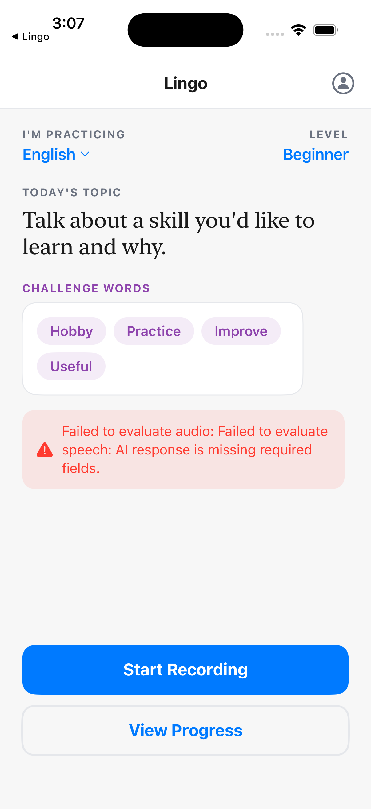
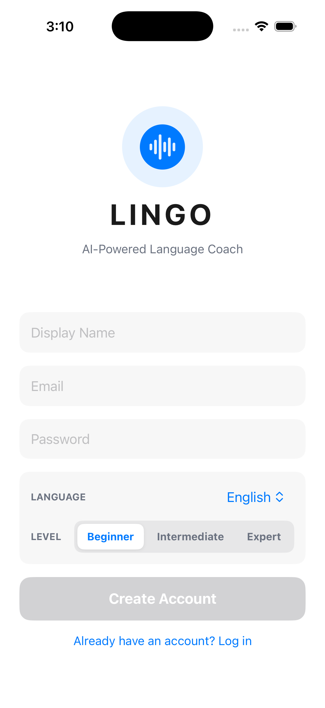

# 🗣️ NewLingo

> **AI-powered language learning — speak, get scored, improve.**

NewLingo is a native iOS app paired with an Express backend that helps you practice speaking in any language. Pick a language, get a prompt, record yourself, and let Gemini AI evaluate your pronunciation, grammar, vocabulary, and fluency — then adapt future sessions to target your weak spots.

<br>

## ✨ Features

🎯 **Adaptive Learning** — Tracks your weakest skills and generates prompts that target them. Spaced repetition keeps vocabulary fresh.

🎙️ **Speech Recording** — Native AVFoundation audio capture, sent to Gemini AI for real-time evaluation.

📊 **Detailed Feedback** — Scores across pronunciation, grammar, vocabulary, and fluency with challenge words and improvement tips.

📈 **Progress Analytics** — Skill radar charts, score trend lines, streak tracking, and vocabulary mastery stats.

🔐 **User Accounts** — JWT auth with persistent login. All progress synced and stored server-side.

<br>

## 🏗️ Architecture

```
newlingo/
├── ios/                        # 📱 Native SwiftUI app
│   └── Lingo/Lingo/
│       ├── Models/             # Data models
│       ├── Services/           # API client + audio recorder
│       ├── ViewModels/         # MVVM state management
│       ├── Theme/              # Colors + reusable styles
│       └── Views/
│           ├── Screens/        # Onboarding, Prompt, Recording,
│           │                   # Feedback, Dashboard, Profile
│           └── Components/     # Radar chart, score cards,
│                               # trend chart, flow layout
│
└── backend/                    # ⚙️ Node.js + Express API
    ├── server.js               # Entry point (port 3001)
    ├── database/
    │   ├── schema.sql          # SQLite schema
    │   └── db.js               # Queries + adaptive learning
    ├── routes/
    │   ├── auth.js             # Register, login, profile
    │   ├── sessions.js         # Prompts, evaluation, history
    │   └── analytics.js        # Learning insights
    ├── services/
    │   ├── gemini.js           # Gemini AI integration
    │   └── adaptive.js         # Smart prompt selection
    └── middleware/
        └── auth.js             # JWT authentication
```

<br>

## 🚀 Getting Started

### Prerequisites

- **Node.js** 18+
- **Xcode** 15+
- **Gemini API key** — [get one here](https://aistudio.google.com/apikey)

### Backend

```bash
cd backend
npm install
cp .env.example .env
```

Add your keys to `.env`:

```env
GEMINI_API_KEY=your_key_here
JWT_SECRET=a_random_secret_string
PORT=3001
```

Start the server:

```bash
npm run dev
```

> 💡 SQLite database is auto-created on first run.

### iOS App

1. Open `ios/Lingo/Lingo.xcodeproj` in Xcode
2. Update the backend URL in `Services/APIService.swift`:
   - Simulator: `http://localhost:3001/api`
   - Device: `http://YOUR_LOCAL_IP:3001/api`
3. Build & run on simulator or device

> 🎤 Grant microphone permission when prompted.

<br>

## 🛠️ Tech Stack

| Layer | Tech |
|-------|------|
| 📱 iOS | SwiftUI · MVVM · AVFoundation |
| ⚙️ Backend | Node.js · Express · SQLite |
| 🤖 AI | Google Gemini |
| 🔐 Auth | JWT · bcrypt |

<br>

## 📸 Screenshots

<p align="center">
  
  &nbsp;&nbsp;
  
</p>

<br>

## 📄 License

MIT
